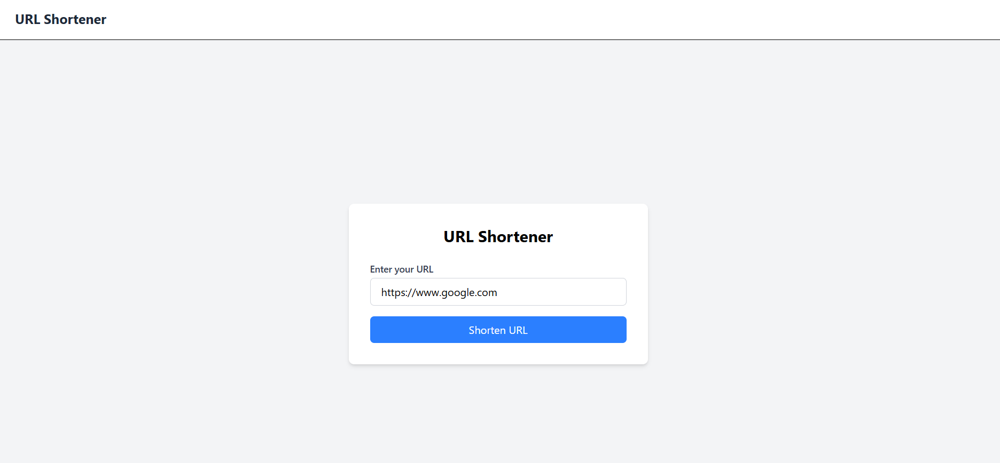
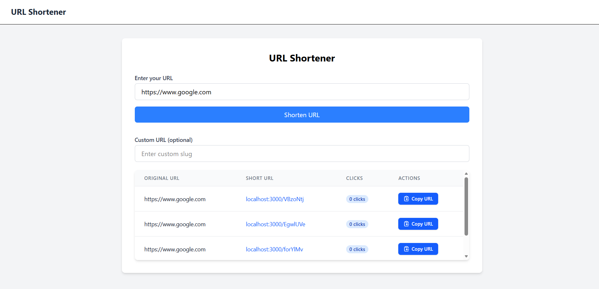
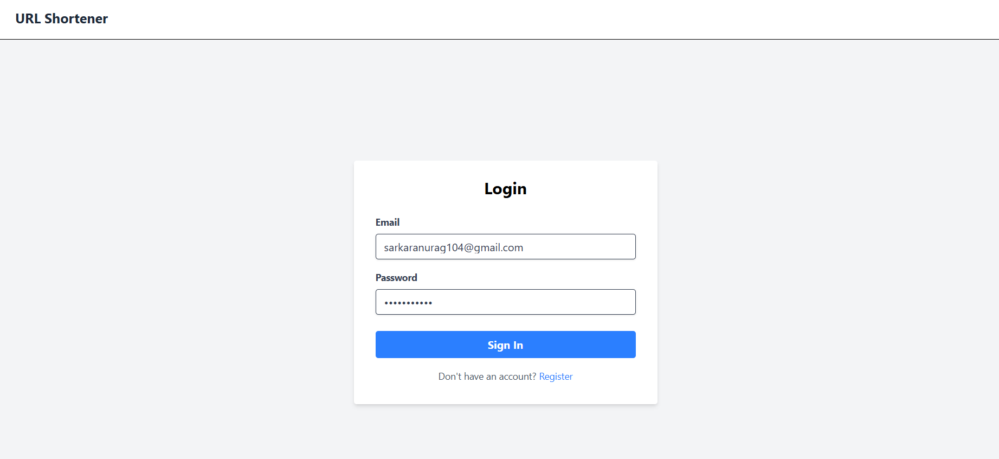
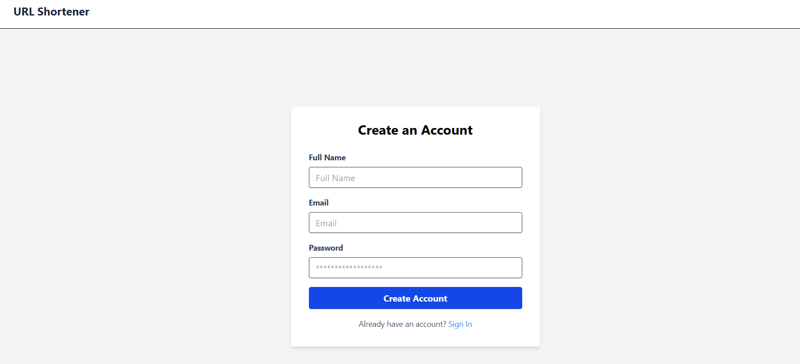
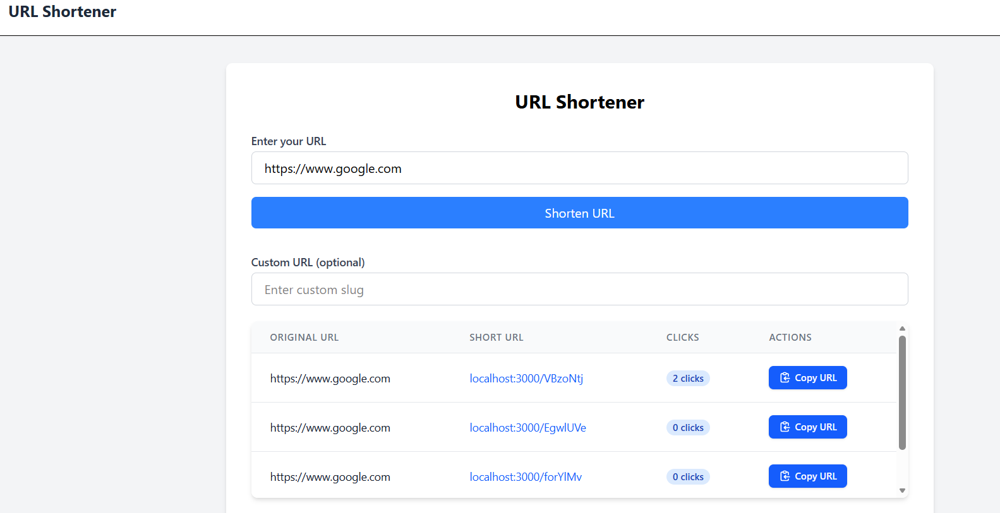

# 🚀 Monolithic URL Shortener

<p align="center">


</p>

**URL Shortener** built using **React, Node.js, Express.js, and MongoDB**. The application enables users to generate short URLs, create custom aliases, manage their links through a personal dashboard, and track click analytics using a secure JWT-based authentication system.

---

## ✨ Features

### 🔗 URL Shortening

- Generate short URLs instantly.
- Anonymous users can create short URLs without logging in.
- Authenticated users can create **custom short URLs**.

---

### 🔐 Authentication

- User Registration
- User Login
- JWT Authentication
- HttpOnly Cookie-based Authentication
- Protected Routes

---

### 📊 Dashboard

- View all created URLs
- Track click counts
- Copy shortened URLs with one click
- Personalized dashboard for authenticated users

---

### ⚡ User Experience

- Responsive UI
- Real-time error handling
- Loading states
- Copy-to-clipboard functionality
- Clean and intuitive interface

---

## 🛠 Tech Stack

### Frontend

- React
- TanStack Router
- TanStack Query
- Redux Toolkit
- Tailwind CSS
- Axios

### Backend

- Node.js
- Express.js
- JWT Authentication
- bcrypt

### Database

- MongoDB
- Mongoose

---

## 📸 Screenshots

> Replace these placeholders with your screenshots.

| Home | Dashboard |
|------|-----------|
|  |  |

| Login | Register |
|------|-----------|
|  |  |

| URL Analytics |
|---------------|
|  |


---

# 🏗️ Architecture

This project follows a **Monolithic Full-Stack Architecture**, where the frontend and backend are developed as separate applications while the backend encapsulates all business logic within a single service.

```
                        +----------------------+
                        |   React Frontend     |
                        |  (Vite + Tailwind)   |
                        +----------+-----------+
                                   |
                          HTTP REST APIs
                                   |
                                   ▼
                    +-----------------------------+
                    |   Express.js Backend         |
                    |-----------------------------|
                    | Authentication (JWT)        |
                    | URL Management              |
                    | User Dashboard              |
                    | Click Analytics             |
                    +-------------+---------------+
                                  |
                           Mongoose ODM
                                  |
                                  ▼
                         +-----------------+
                         |    MongoDB      |
                         +-----------------+
```

---

# 📂 Project Structure

```text
monolithic-url-shortener/
│
├── BACKEND/
│   ├── config/
│   ├── controllers/
│   ├── dao/
│   ├── middleware/
│   ├── models/
│   ├── routes/
│   ├── services/
│   ├── utils/
│   ├── app.js
│   └── package.json
│
├── FRONTEND/
│   ├── public/
│   ├── src/
│   │   ├── api/
│   │   ├── components/
│   │   ├── pages/
│   │   ├── routing/
│   │   ├── store/
│   │   ├── utils/
│   │   ├── App.jsx
│   │   └── main.jsx
│   │
│   └── package.json
│
├── screenshots/
├── README.md
└── package.json
```

---

# ⚙️ Installation

## 1️⃣ Clone Repository

```bash
git clone https://github.com/Rohitsingh24-cloud/monolithic-url-shortener.git
```

```bash
cd monolithic-url-shortener
```

---

## 2️⃣ Install Root Dependencies

```bash
npm install
```

---

## 3️⃣ Install Backend Dependencies

```bash
cd BACKEND
npm install
```

---

## 4️⃣ Install Frontend Dependencies

```bash
cd ../FRONTEND
npm install
```

---

## 5️⃣ Configure Environment Variables

Create a `.env` file inside the **BACKEND** folder.

```env
PORT=3000

MONGO_URL=your_mongodb_connection_string

JWT_SECRET=your_secret_key

APP_URL=http://localhost:3000
```

---

## 6️⃣ Start the Project

From the root directory

```bash
npm run dev
```

This starts both:

- React Frontend
- Express Backend

simultaneously.

---

# 🔒 Authentication Flow

```text
User Login
      │
      ▼
Backend verifies credentials
      │
      ▼
JWT Token Generated
      │
      ▼
Stored as HttpOnly Cookie
      │
      ▼
Protected Routes Verified
      │
      ▼
Dashboard Access
```

---

# 💡 System Design Highlights

This project follows software engineering best practices to ensure maintainability and scalability.

- ✅ Layered Backend Architecture (Routes → Controllers → Services → DAO → Models)
- ✅ RESTful API Design
- ✅ JWT Authentication using HttpOnly Cookies
- ✅ Secure Password Hashing with bcrypt
- ✅ Modular React Component Architecture
- ✅ Redux Toolkit for Global State Management
- ✅ TanStack Query for Server State Management
- ✅ Axios Interceptors for Centralized Error Handling
- ✅ MongoDB Indexing for Fast URL Lookup
- ✅ Global Error Handling Middleware

---

# 📚 REST API

## Authentication

| Method | Endpoint | Description |
|---------|----------|-------------|
| POST | `/api/auth/register` | Register a new user |
| POST | `/api/auth/login` | Login user |
| POST | `/api/auth/logout` | Logout current user |
| GET | `/api/auth/me` | Get authenticated user |

---

## URL Management

| Method | Endpoint | Description |
|---------|----------|-------------|
| POST | `/api/create` | Generate Short URL |
| GET | `/:shortUrl` | Redirect to Original URL |

---

## User

| Method | Endpoint | Description |
|---------|----------|-------------|
| POST | `/api/user/urls` | Get all URLs created by logged-in user |

---

# 🔄 Request Example

## Create Short URL

```http
POST /api/create
```

```json
{
    "url":"https://example.com",
    "slug":"my-custom-url"
}
```

---

## Response

```json
{
    "shortUrl":"http://localhost:3000/my-custom-url"
}
```

---

# 🛡 Authentication

Authentication is implemented using **JWT stored in HttpOnly Cookies**, providing improved security against client-side token access.

Workflow:

- User logs in
- Backend verifies credentials
- JWT token generated
- Token stored as HttpOnly Cookie
- Protected routes validate token
- Authenticated user gains dashboard access

---

# 🚀 Future Improvements

This repository represents the **Monolithic (Version 1.0)** implementation.

Planned enhancements:

- [ ] Redis Caching
- [ ] BullMQ Background Workers
- [ ] Rate Limiting
- [ ] URL Expiration
- [ ] QR Code Generation
- [ ] Docker Support
- [ ] Kubernetes Deployment
- [ ] API Gateway
- [ ] Microservices Architecture
- [ ] Load Balancing
- [ ] Distributed Analytics

---

# 🤝 Contributing

Contributions, suggestions and improvements are welcome.

Feel free to fork the repository and open a Pull Request.

---

# 👨‍💻 Author

**Rohit Singh**

If you found this project helpful, consider giving it a ⭐ on GitHub.
